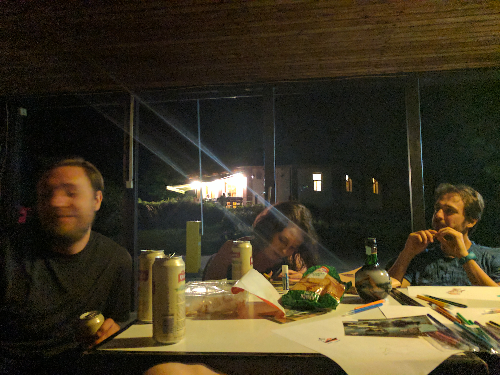
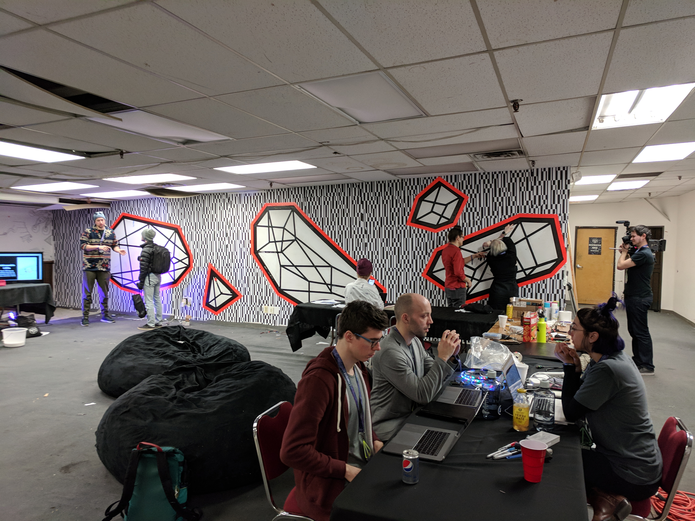
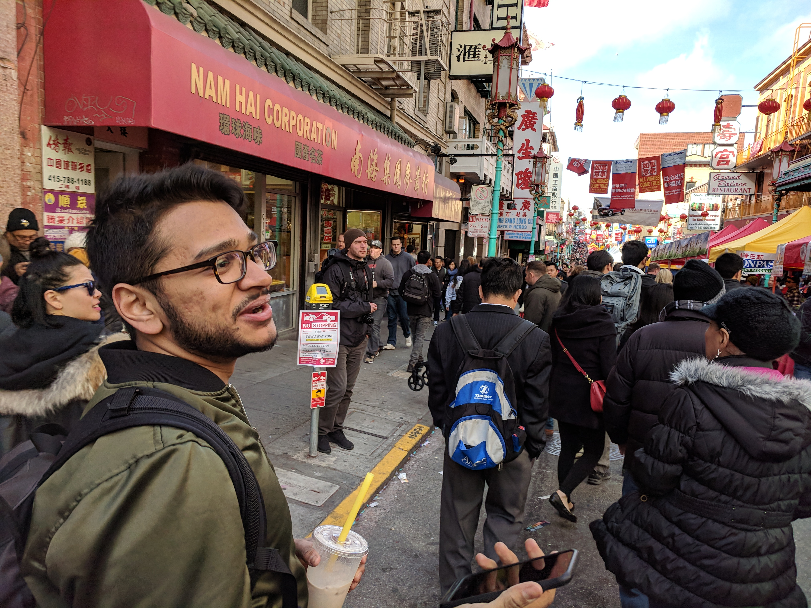

today i'm curious about why i like _things_ so much

by _things_ i mean the crystallization of experience. they need not be analog, physical things. increasingly, i'd prefer that they're digital, atemporal things. but they're things that are more than their make up. they store experience and memories and meaning. more correctly, they make you remember, they point to meaning, the thing is dumb but the perception of the thing is smart.

the analog medium provides some features that make things good at what they do—storing experiences. wear and tear are visible and highly understood. leather boots accumulate your travels and a well-worn coat tells a story

tiny trinkets from nowhere have meaning explicitely because they're meaningless to everyone but you

location-based scarcity is a key concept for analog things. in horizon, the author talks about trinkets he's collected over years of traveling. in the beginning they're all meaningless to the reader. at the end they only have meaning because they have meaning to the author. an interesting phenomenon. rocks from a beach filled with similar rocks. this rock has meaning because i chose it.

nostalgia seems to be the same phenomenon at work. life is a meaningless series of random decisions, made meaningful by my existence and nothing else. there's a quote about that, i'll try to find it here:

to take a cue from lewis carol, objects of my past feel meaningfulless. and old shirt i wore as a kid, givin to me by an uncle. it's nonutilitarian (ragged, now to small) and useless. and yet, removing it from my life is painful.

as a self described minimalist, i survive with bouts of existentialism that make the act of throwing things away meaningless. too attached to physical objects of the past? get into a nice depressive funk about the meaninglessness of life and suddently those things don't matter

another aspect that's a blessing and a curse is my ability to forget everything. i'm great at keeping secrets because i don't care about your secrets and aOOP there is goes, never to be remembered again. my garbage collector is working overtime, too hard, perhaps

i forget myself. i was asked today when the last time i was in new york was. i remember what i did but no clue when it was, relative to the timeline of my past. i legitimately can't remember what i did before or after that snapshot of time. figuring out when that is requires working backwards from today, reconstructing my past by dredging the swamp of memories, forcing them out through the mud, shaking them around, and squinting at shaky handwriting through the brine.

this means i change easily. i accept the new easily. for what was the old to me? gone.

but i treasure my past. it is a meaningfulless series of occurrences, but their _my_ meaningfulless series of occurrences. when i started traveling i decided to take a lot of pictures. not the normal travel pictures. pictures of meaningfulless everyday things. i'm eating dinner at an ok 6/10 cafe in europe? i'll take a picture of what i see there, right that second. usually when people aren't looking, because how do you explain that the picture is meaningfulless.

i treasure these pictures precisely because they're meaningfullessness. whenever i decide to look at them, i'm stuck by their meaningfullessness—there's nothing there, but it serves as a teleport back to that time and place. and the meaningfullessness of that time and place. these pictures are imbued with an experience. sometimes i'll look at a picture and forget the time and place and wonder to myself "what the fuck was i doing here" and that's kinda fun. sometimes it takes minutes of dredging to remember a time and place

in any case, this is supposed to be about digital things and imbuing them with experience and meaningfullessness.

digital things are great because analog things take up orders of magnitude more space and time. digital things have much fewer constraints on their form and function. but because of this freedom there's no natural or authentic way to derive properties that make analog things so good at being imbued with meaning. there's no environment and context around the meaningfulllessness of digital things as there is with analog — digital things don't patina, you can't easily flex ownership of a digital thing in a relevant social context like you can when you wear a pair of shoes out on the streets.

this is getting too long and i have work to do. i want more digital things to imbue with meaning. but i want the authenticity of imbuing analog things with meaning. i'm not sure if those are contrary goals. the default space is analog. doing anything in the digital world feels inauthentic. going to a bar to collect a digital check-in token is much less 'authentic' than collecting all of the analog poker chips from harley davidson dealerships.

because of the environment we're in — and it being the default — imbuing meaning is authentic and natural. anything else feels inauthentic and unnattural. this will change. digitally native environments like video games and vrchat make digital ownership and imbuing of meaning more natural and the expression of that meaning more authentic. but the key, imo, is the bridge between the two. the ability for digital things to have natural, authentic meaning in the analog world.
