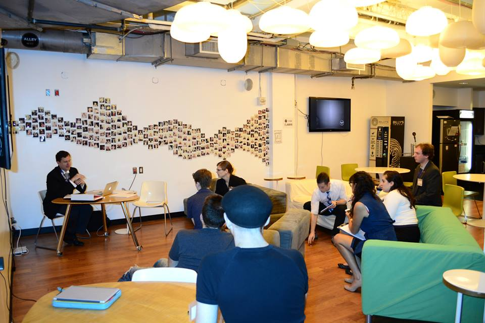
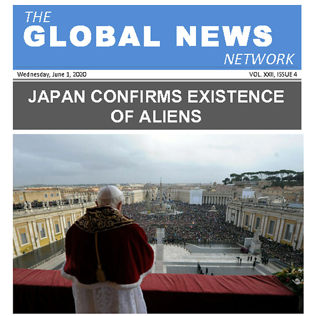
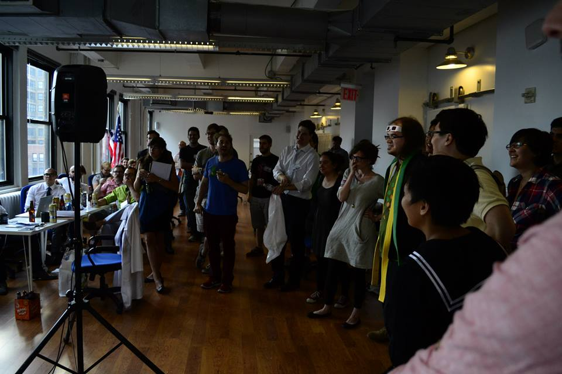

# The USA's First Megagame
... hosted in NYC and organized by hackNY Fellow [Shy Ruparel](http://ruparel.co)!

## WTF is a Megagame?
In general, a megagame is just a **large gathering of gamers, all playing the same game**. This is a pretty vague definition.

_Watch the Skies!_ is a megagame developed by a British game designer and previously held in Britain. [Shy](https://twitter.com/shyruparel), saw the game and decided to host the first instance of the game in the US.

As you can imagine, this required an absurd amount of planning, incorporating game design, rule modifications, community management, food services, event scheduling and hosting, and more. I'm extremely impressed that Shy and a few other volunteers made the event such a flawless experience.

## Watch the Skies!
The gist of Watch the Skies is that there are 8 super powers in world in 2020 and the **existence of aliens has been known since the 50's** when governments covered up various extraterrestrial sightings and skirmishes. For the most part, the aliens have kept to themselves.

**Except in 2020, a new mysterious force has taken hold of them.**

Suddenly, the countries of Earth, each made up of 4-5 human participants, must join together (or not!) to defeat (or help!) the alien menace (alien saviors?).

**Suffice to say, there was a lot of cooperation, coordination, secrecy, and backstabbing. It was _awesome._**

## Gameplay
The gameplay itself is very similar to a board games, but noticeably more involved, with multiple, independent, yet interwoven, fronts where each human gamer was able to drastically influence the tide of the game. On each country, there was a Prime Minister, (sometimes) a Deputy Prime Minister, a Chief Scientist, a Foreign Diplomat, and a Minister of Defense.

They each had different roles, associated powers, and personal motivations.

**For a country to be effective, the entire team needed to excel at their positions and works together towards a common goal.**

## Global Press and Public Relations
There were also dedicated players role-playing as reporters from the Global News Network, or GNN. They took pictures and wrote reports of the goings on in the world, publishing a 2 page newsletter each turn. The countries would occasionally answer questions from the reporters or public press releases in an attempt to raise their Public Relations level, which in turn allowed them more resources for the next turn. Of course, the press could spin stories any way they wanted to!

[Check out all of the press releases during the event!](https://imgur.com/a/AUYTu)

## Managing Resources
As with all good games, the players needed to manage resources and determine the best way to allocate their research points per turn. Some countries, like the US, started with lots of resources. Others, like Brazil, started with fewer. Every country had something that made them unique; Japan had a geological advantage, but no conventional military forces or nuclear weapons, and Russia generated less resources per turn, but also got one special resource, which made them more flexible. **A large part of the game was adapting to new circumstances.**

##Speaking of New Circumstances...
Crazy shit happened every turn. Here are some highlights:

- The Pope planned to announce the existence of aliens...
    + Which is really bad for everyone's public relations score, so the United Nations _collectively decided to assassinate the Pope._
    + Except, Japan announced the existence of aliens before the Pope could make the announcement.
    + **I, as the Japanese Minister of Defense, placed an agent in the Vatican who impersonated the Pope, who then came out in favor of the aliens and Japan, making the default massive PR drop actually a positive.**
- India placed an agent in Japan and poisoned its water supply.
- Aliens needed to do research on humans to advance their tech tree, and weren't getting any humans via abductions, so they convinced countries to give them humans and in return they would demonstrate their "healing powers".
- Countries made a show of destroying their nuclear arsenals by ripping the game pieces in half after long speeches about freedom and peace.
- Countries collectively banded together to advance technology enough to build an orbiter that could start a colony on Mars.
- Aliens visited the UN and addressed the countries.
- Brazil had partnered with the aliens from the beginning, without the knowledge of anyone else.

**At the end of the game, during the last turn, Brazil let the entire alien fleet land in their country. They refused to let other countries fly into their airspace, effectively protecting the alien invasion.**

**In retaliation, Russia launched nuclear missiles at Brazil.**

**Except Brazil has placed an agent in Russia who managed to sabotage the missile launch, causing the missiles to explode in the tube, effectively blowing up Russia.**

And it was awesome.

So, the alien successfully invaded as the majority of the countries on Earth reached out to Mars.

## The Aftermath
Turns out that aliens had visited Earth before and accidentally mutated into the human race its aggressiveness and war. They worried that human's technology was quickly approaching instellar travel, and they would soon spread their aggression throughout the universe. They planned to stop the spread by breeding the mutation out of the species, by abduction, modification, and replacements. And they nearly succeeded, too.

## In Retrospect
Megagames are **mega fun**. As a participant, you never have the entire picture of what's going one; you have to rely on your teammates and their actions and quick-wittedness to carry the group forward. There are defined rules, but feel free to deviate within the lore of the game, because, after all, anything can happen in the scenarios you're role-playing.

## Personal Reflection
I'm not a role-player by any means. I only learned about Settlers of Catan this summer and discovered MTG about 2 months ago.

**The fact that I had an absurd amount of fun at NYCMegagamer's Watch the Skies is a testament to how awesome megagames, and, in particular, Watch the Skies was.**

I highly recommend researching megagames and attending one!

[Here is a video](http://www.shutupandsitdown.com/videos/v/susd-play-megagame/) from the British megagamer makers group, detailing their version of Watch the Skies!

