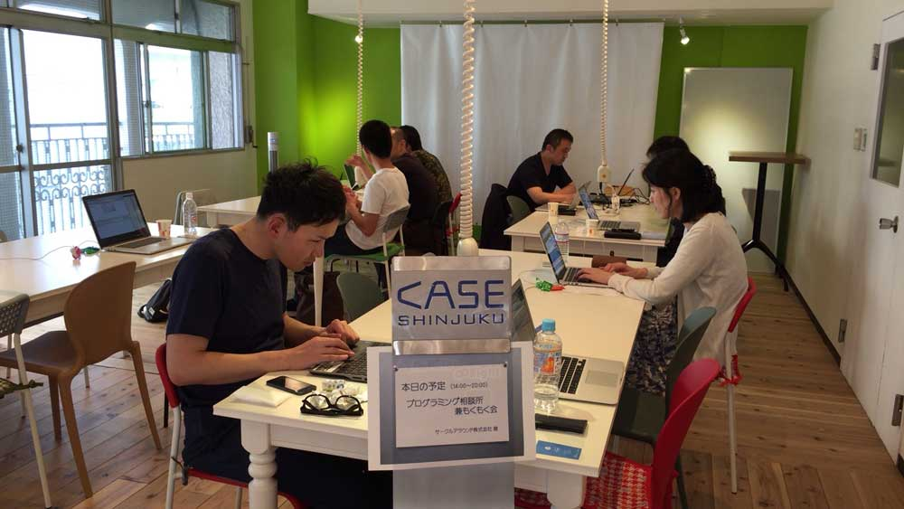
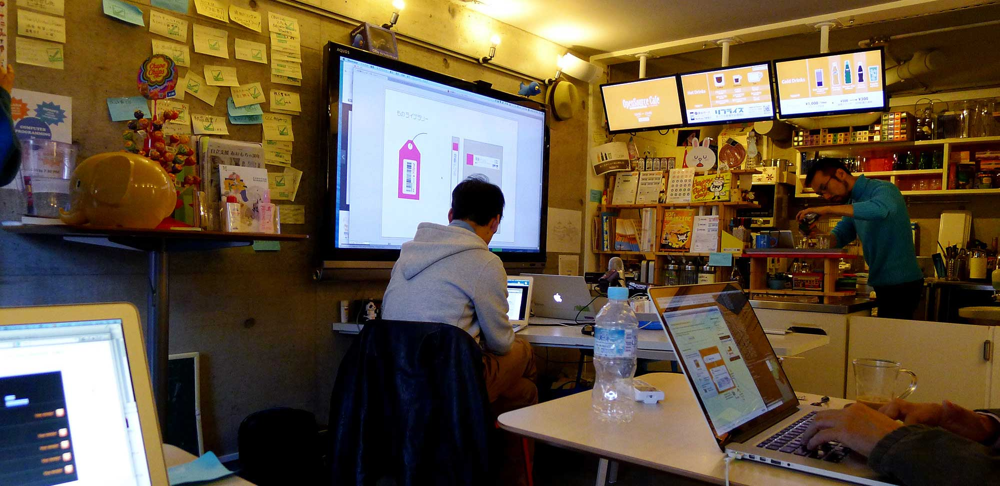
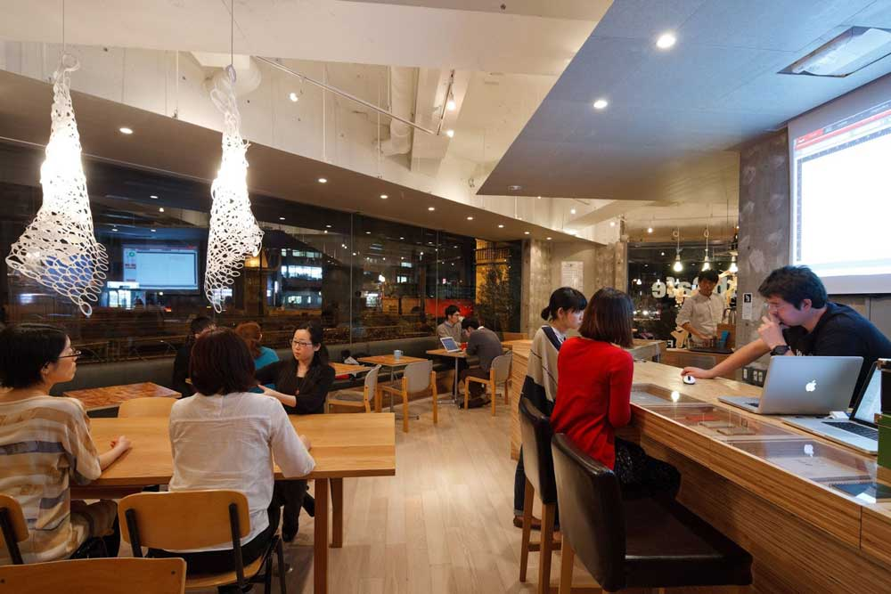

# Working Around Other People, By Default

The concept of "working around other people by default" has led to some of my favorite experiences; it organically creates a creative, collaborative environment that you won't find anywhere else, and I want to bring that feeling to a consistent location in New York.

## re: New York

I think the biggest impact on the NYC technology ecosystem will be the creation of a central location where interesting, creative people can go to work around other interesting, creative people. I’m imagining a space similar to a cafe, in the sense that individuals and groups go there to work on projects, that promotes a much larger understanding of community and collaboration, just like the early days of casual hackathons. My best friendships were forged in similar circumstances and I’ve been searching for ways to extend that same experience to everyone.

I believe that this concept of “working around other people by default” is one of the best ways to encourage community growth and creativity. Exactly two years ago, I was a Physics and Electrical Engineering major at Louisiana Tech, an engineering college in small-town Louisiana. I was one of a small group of students interested in what I now know as hacker culture, that is, building things just to build them and to have fun doing it; we’d get together after class and just work on projects in the same room. The group grew out of a need for environment; we collaborated on ideas and problems, of course, but that happened organically, not intentionally.

The summer afterwards, I was a [hackNY Fellow](http://hackny.org/a/) and had the best time of my life, largely due to the living situation; we had a common room in NYU’s Palladium Hall where all of the fellows hung out together, by default. We initially only worked on our own projects, but curiosity drew groups together around ideas and the community grew because of it. I witnessed the same organic collaboration and growth last summer when I mentored the next class of hackNY Fellows. Because everyone’s in the same space, they share ideas, they solve problems, they work together, and the community as a whole grows stronger.

And I see it even more around the world, most notably in Tokyo at a converted garage, dubbed [The Open Source Software Cafe](http://www.osscafe.net/en/). Members of the OSS Cafe have built an incredible community of creatives and entrepreneurs in Tokyo; a community that didn’t exist five years ago. The owner of the space knows more than 100 of the community members by name and is working on several open source projects with different members, simply as a side effect of mutual interests. They have an actively shared library of books on topics ranging from entrepreneurship to linguistics and beyond. They host learn-to-code events for kids, taught by volunteers from the community, and they broadcast interviews, tutorials, and discussions on the web.

I’m writing this from the OSS Cafe, surrounded by 10 other amazing programmers from around the world (thanks to [Hacker Paradise](http://www.hackerparadise.org/)); countries represented over the last month include the US, Germany, Russia, Israel, Canada, Japan, and Lithuania. Yesterday we brainstormed projects together and earlier today I helped debug some Ruby code and gave feedback on a friend’s VC pitch. None of this is possible without the space that a collaborative community can call home.

## Making It Real

I'm not talking about a coworking space. I'm talking more about a space where people work, collaboratively. It's different, I swear!

The idea is similar to a [jelly](http://www.workatjelly.com/) in that it's incredibly informal, but it's a consistent, stable place where people can go to work and are guaranteed to be surrounded by other interesting people working in their own interesting projects. Like a cafe, but with community. Or a hackerspace/makerspace for coding that also has great coffee and environment.

This is just a dream at the moment, but hey, it might eventually be a thing.


